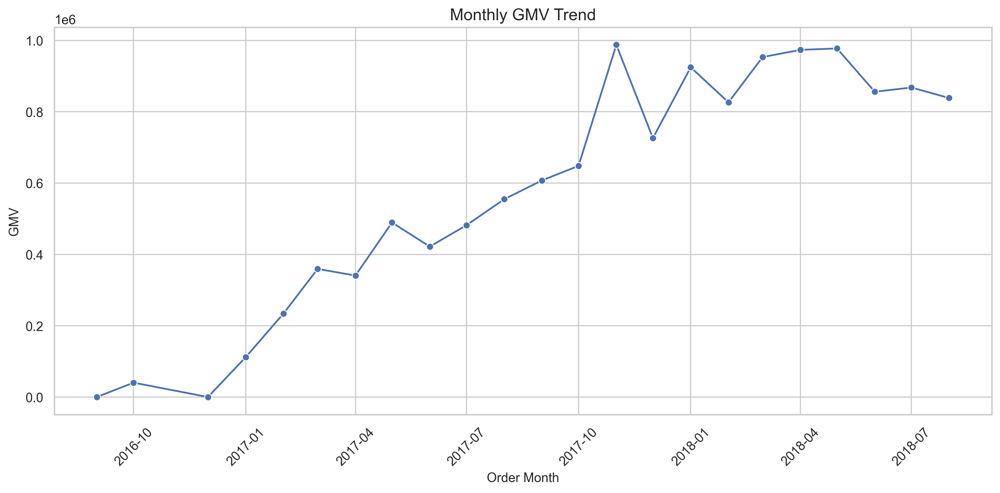
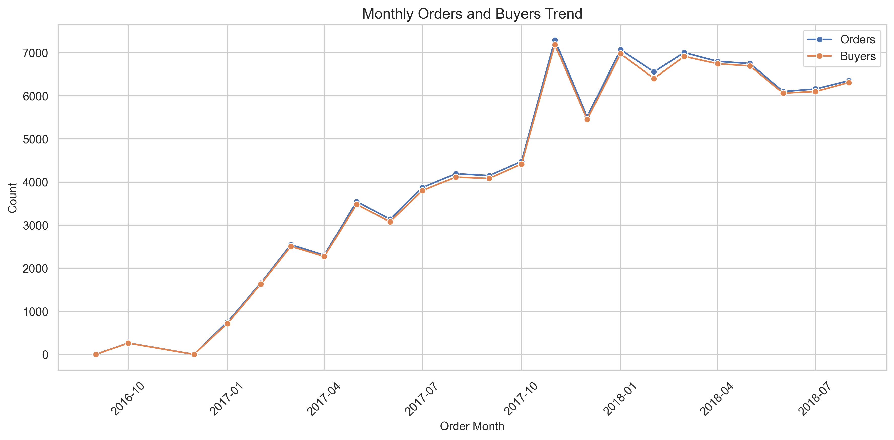
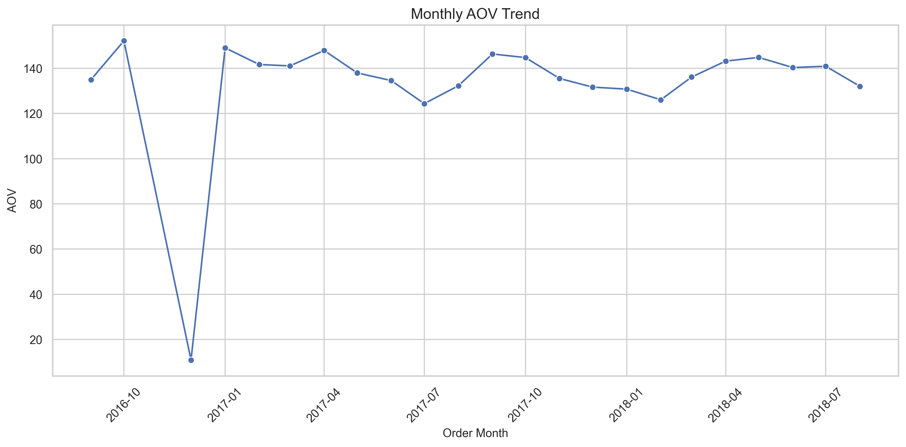
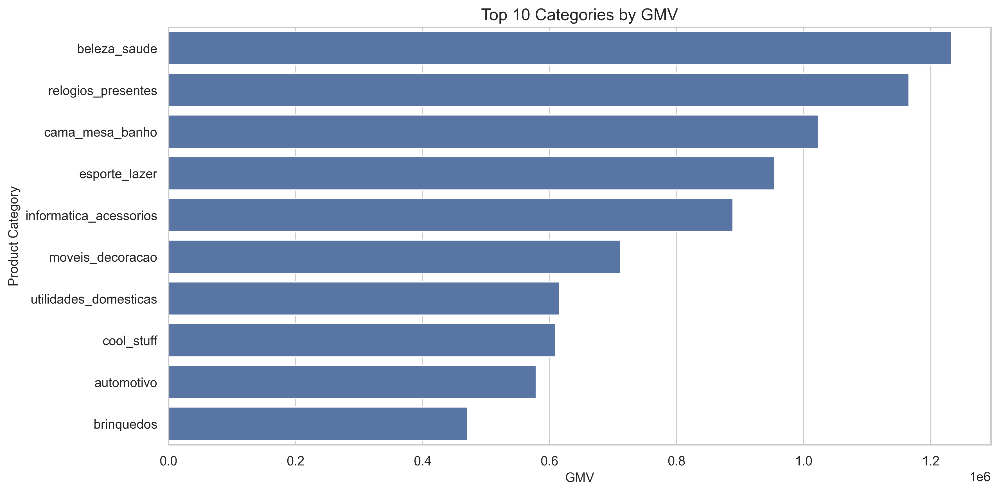
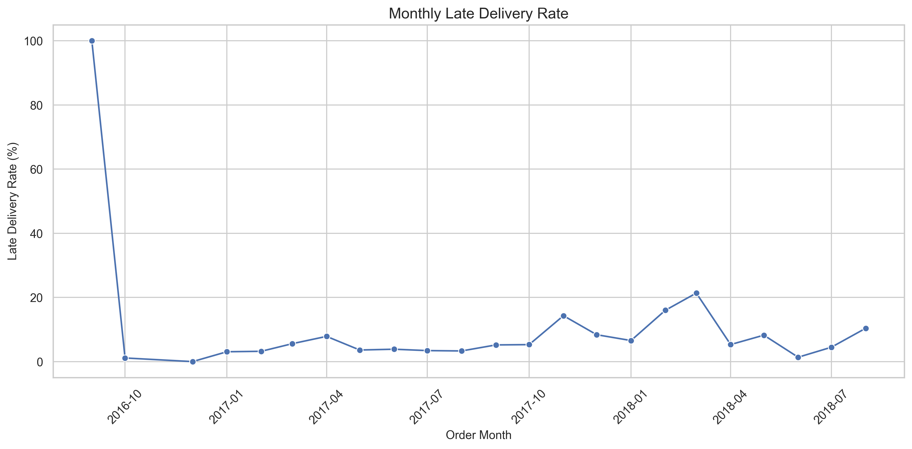
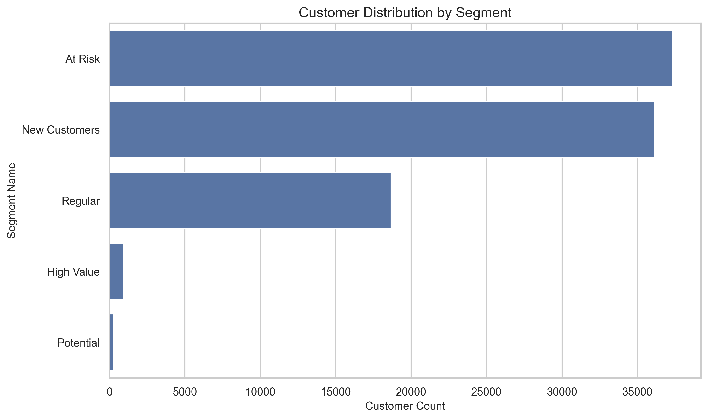
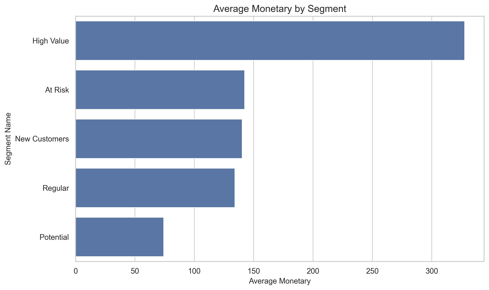
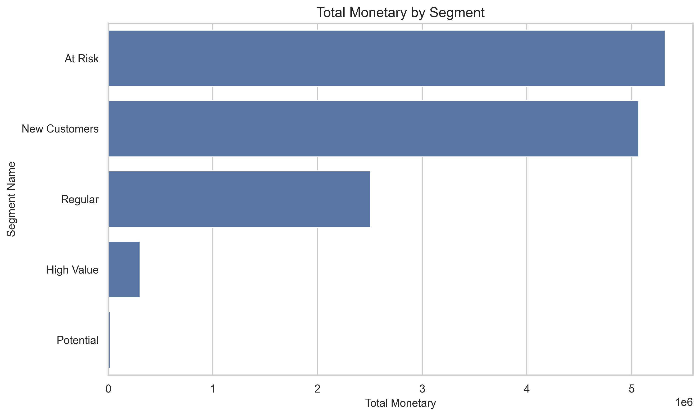
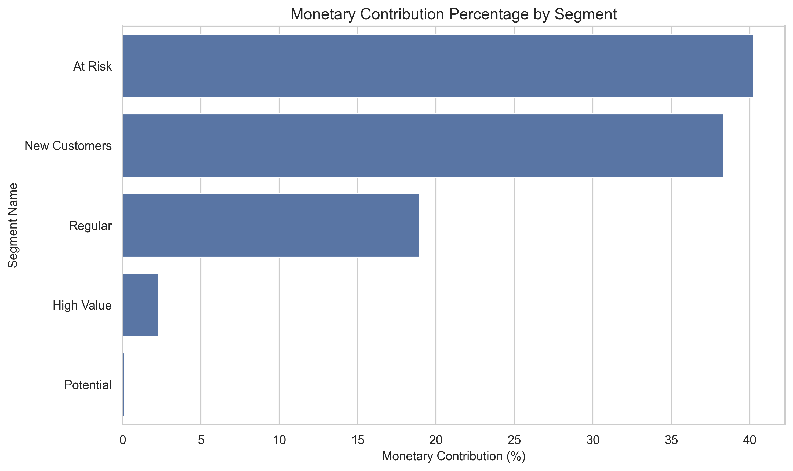

# Ecommerce-GMV-Customer-Analysis

## Project Overview

This project is an end-to-end e-commerce data analysis case based on the **Olist Brazilian E-commerce Dataset**.  
The goal is to build a GitHub-ready analytics project that covers:

- MySQL data import
- SQL data cleaning
- Core business KPI analysis
- RFM customer segmentation
- Fulfillment and review analysis
- Python visualization for business storytelling

This repository is designed as a practical portfolio project for data analysis roles, with a complete workflow from raw CSV files to business conclusions.

## Business Questions

This project focuses on the following questions:

1. How does GMV change over time?
2. Is business growth driven by buyer growth, order growth, or AOV growth?
3. Which product categories contribute the most revenue?
4. How strong is customer repeat purchase behavior?
5. How does delivery performance affect customer ratings?
6. Which customer groups deserve the most operational attention?

## Dataset

Dataset source:

- **Brazilian E-Commerce Public Dataset by Olist**

Tables used in this project:

- `olist_orders_dataset.csv`
- `olist_order_items_dataset.csv`
- `olist_customers_dataset.csv`
- `olist_products_dataset.csv`
- `olist_order_reviews_dataset.csv`
- `olist_order_payments_dataset.csv`

Dataset description:

- `orders` defines the order lifecycle and is the main fact entry for business analysis.
- `order_items` provides item-level revenue detail and supports GMV and category analysis.
- `customers` provides the customer identity layer, especially `customer_unique_id` for buyer-level analysis.
- `products` supports category-level business interpretation.
- `reviews` supports customer satisfaction analysis.
- `payments` supports payment reconciliation against item and order revenue.

Why these six tables:

- They are sufficient to build a complete analysis flow from order creation to payment, fulfillment, review, and customer segmentation.
- They support both KPI analysis and user-level RFM analysis without introducing unnecessary complexity from unrelated auxiliary tables.

Core analytical grain:

- `orders`: one row per `order_id`
- `order_level_dataset`: one row per `order_id`
- `rfm_customer_segments`: one row per `customer_unique_id`

## Tech Stack

- Python
- pandas
- numpy
- matplotlib
- seaborn
- SQLAlchemy
- PyMySQL
- Jupyter Notebook
- MySQL 8.x

## Methodology

The analysis workflow is organized into the following stages:

1. Initialize MySQL database
2. Create six source tables
3. Import raw CSV files into MySQL
4. Perform SQL data cleaning and validation
5. Build `order_level_dataset` as the order-grain analysis table
6. Compute core business metrics
7. Build RFM customer segmentation
8. Visualize findings with Python notebooks
9. Summarize business insights and recommendations

Key SQL scripts:

- `sql/00_init_database.sql`
- `sql/01_create_tables.sql`
- `sql/02_data_cleaning.sql`
- `sql/03_core_metrics.sql`
- `sql/04_rfm_analysis.sql`

## Core Results

Delivered-order KPI summary:

- **Total GMV:** `13,221,498.11`
- **Total Orders:** `96,478`
- **Total Buyers:** `93,358`
- **Overall AOV:** `137.04`
- **Overall Repeat Rate:** `3.00%`

Interpretation:

- Business scale is already meaningful, but repeat purchase remains weak.
- The number of buyers is close to the number of delivered orders, which means the platform still relies heavily on one-time buyers.
- Growth quality is weaker than growth quantity: the business is growing, but retention is not yet strong.

## Visualization Highlights

### 1. Monthly GMV Trend



Key takeaway:

- GMV shows clear expansion from 2017 into 2018.
- The strongest months appear in late 2017 and early-to-mid 2018.
- Growth is not mainly driven by AOV, but by more buyers and more orders.

### 2. Monthly Orders and Buyers Trend



Key takeaway:

- Orders and buyers move upward together, suggesting that GMV growth is strongly linked to customer acquisition and transaction volume expansion.
- The gap between orders and buyers remains small, reinforcing the conclusion that repeat purchase is limited.

### 3. Monthly AOV Trend



Key takeaway:

- AOV stays relatively stable over time.
- This means GMV growth is structurally more dependent on scale growth than on order-value improvement.

### 4. Top Categories by GMV



Key takeaway:

- Revenue is concentrated in a small number of core categories.
- Categories such as `beleza_saude`, `relogios_presentes`, and `cama_mesa_banho` form the revenue backbone of the platform.

### 5. Monthly Late Delivery Rate



Key takeaway:

- Late delivery is not an isolated issue.
- Fulfillment stability matters because delivery performance directly affects customer experience.

### 6. RFM Segment Distribution



Key takeaway:

- The largest customer groups are `At Risk` and `New Customers`.
- `High Value` users exist, but their share is very small.

### 7. Average Monetary by Segment



Key takeaway:

- `High Value` users clearly outperform other groups in average customer value.
- This segment is strategically important even if it is small in size.

### 8. Total Monetary by Segment



### 9. Monetary Contribution Percentage by Segment



Key takeaway:

- `At Risk` and `New Customers` represent the largest value pools in absolute terms.
- This means the most practical business leverage may come from converting and reactivating those large groups rather than focusing only on the top 1% of users.

## Key Findings

### 1. Growth Is Mainly Driven by Scale Expansion

- Monthly GMV growth is mainly explained by buyer growth and order growth.
- AOV remains relatively stable, so basket value is not the main source of expansion.

### 2. Repeat Purchase Is Weak

- Overall repeat rate is only `3.00%`.
- `97%` of buyers placed only one delivered order.
- The business currently depends more on acquiring new customers than retaining existing ones.

### 3. Revenue Is Concentrated in Core Categories

- A small number of product categories account for a large share of GMV.
- These categories should be treated as core commercial assets for future strategy.

### 4. Fulfillment Has a Direct Impact on Ratings

- Average late delivery rate is `8.11%`.
- Late orders have an average review score of `2.57`.
- On-time orders have an average review score of `4.29`.

This gap is large enough to treat delivery performance as a business priority, not just an operational metric.

### 5. Customer Structure Is Not Yet Healthy

RFM segmentation shows:

- `At Risk`: `40.00%`
- `New Customers`: `38.71%`
- `Regular`: `20.00%`
- `High Value`: `1.00%`
- `Potential`: `0.29%`

This means the platform has a large flow of users, but customer value accumulation is still weak.

## Business Recommendations

### 1. Improve Second-Purchase Conversion

The most important short-term opportunity is to turn first-time buyers into repeat buyers.

Suggested actions:

- post-purchase coupon strategy
- related-category recommendation
- second-order reminder campaigns

### 2. Reactivate At Risk Customers

`At Risk` customers are both numerous and valuable in total monetary contribution.

Suggested actions:

- build reactivation rules by recency and historical spend
- prioritize higher-value at-risk users in CRM campaigns

### 3. Reduce Late Delivery First

Since delivery delays strongly damage review scores, fulfillment optimization should start from:

- reducing late-delivery cases
- identifying unstable logistics links
- improving customer expectation management

### 4. Focus Operations on Core Revenue Categories

High-GMV categories should receive more attention in:

- inventory planning
- pricing and promotion
- repeat-purchase strategy design

## Project Structure

```text
ecommerce-gmv-customer-analysis/
|-- README.md
|-- requirements.txt
|-- .gitignore
|-- .env.example
|-- data/
|   |-- raw/
|   `-- processed/
|-- sql/
|-- notebooks/
|-- src/
|-- dashboards/
`-- docs/
```

## Local Run

### 1. Install Dependencies

```powershell
py -m pip install -r requirements.txt
```

### 2. Configure Environment Variables

Create a local `.env` file based on `.env.example`:

```env
DB_HOST=127.0.0.1
DB_PORT=3306
DB_USER=root
DB_PASSWORD=your_mysql_password
DB_NAME=ecommerce_gmv_customer_analysis
```

### 3. Validate Raw Data

```powershell
py src/validate_raw_data.py
```

### 4. Import Data

```powershell
py src/data_loader.py
```

### 5. Execute SQL Analysis

Run in order:

1. `sql/00_init_database.sql`
2. `sql/01_create_tables.sql`
3. `sql/02_data_cleaning.sql`
4. `sql/03_core_metrics.sql`
5. `sql/04_rfm_analysis.sql`

### 6. Run Notebooks

- `notebooks/02_business_analysis.ipynb`
- `notebooks/03_rfm_analysis.ipynb`

## Project Value

This project demonstrates a complete data analysis workflow:

- raw data ingestion
- relational schema design
- SQL cleaning
- order-level metric modeling
- customer segmentation
- Python visualization
- GitHub-ready business storytelling

For a first e-commerce analytics portfolio project, this repository already covers the essential workflow expected in junior data analyst interviews.
